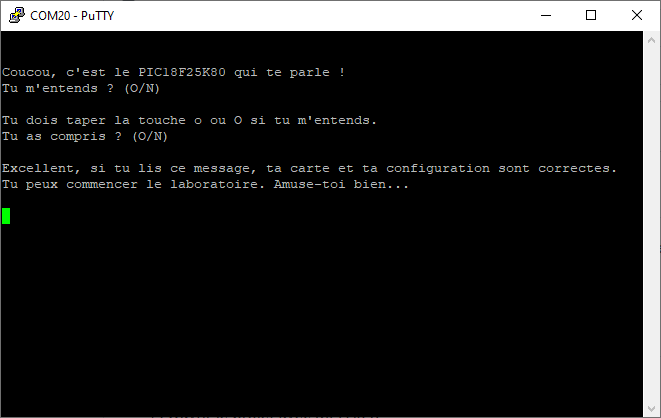

# test_uart

Ce programme vérifie que votre carte PIC 18F et la configuration de votre ordinateur permettent une communication dans les deux directions (RX/TX).

# Installation

1. Cloner ou télécharger le répertoire git localement
2. Ouvrir le projet avec MPLAB X
3. Cliquer sur "Make and Program Device"
4. Configurer votre terminal (Tera Term, Putty...) en 9600 8-N-1

Note : Vous pouvez également programmer directement l'executable présent dans le répertoire bin

# Utilisation

Suivre les étapes suivantes :

- Programmer le PIC
- Ouvrir le terminal
- Choisir le port COM
- Configurer la liaison série en 9600 8-N-1
- Appuyer sur le bouton "Reset" de la carte PIC

